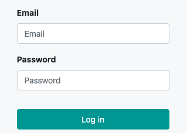
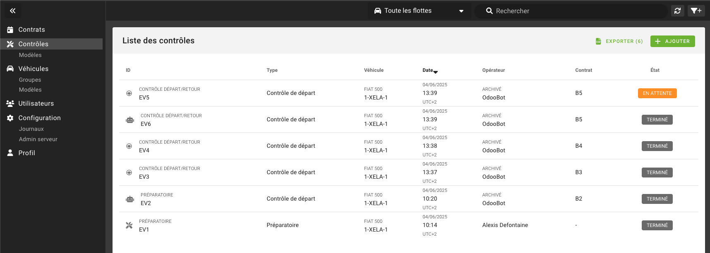

# Première connexion

Pour accéder au portail :

1. Rendez-vous sur l'URL fournie par votre responsable.
2. Saisissez votre **adresse email** et votre **mot de passe**.
3. Cliquez sur **Se connecter**.

<!-- ---

Une fois connecté, vous arriverez par défaut sur la page listant les [États des lieux](../lexique.md#etat-des-lieux).

 -->
